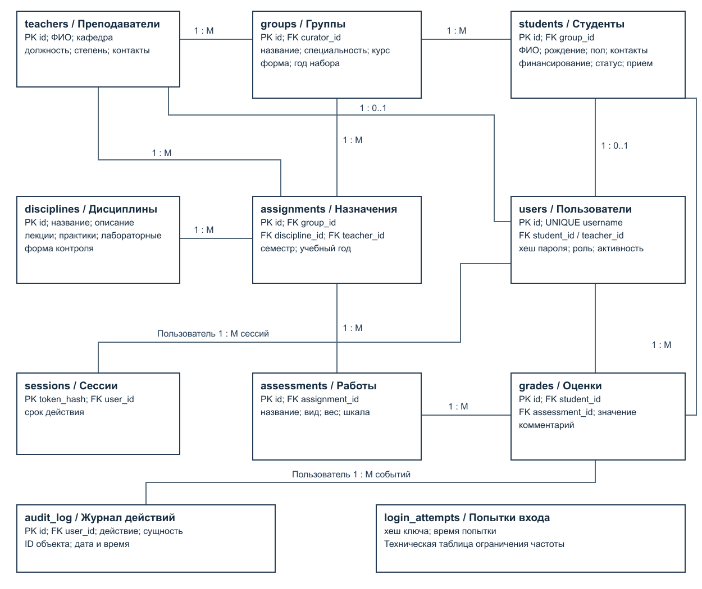
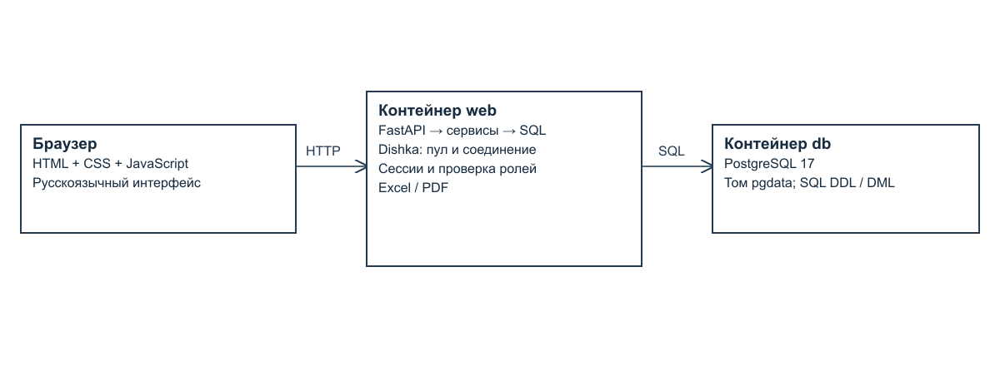

# 2 ER диаграмма и описание базы данных

## 2.1 Концептуальная модель

Основные сущности — преподаватель, группа, студент, дисциплина, назначение, контрольная работа, оценка и пользователь. Сущность назначения связывает дисциплину с группой, преподавателем и периодом. Сущность работы позволяет хранить веса и типы промежуточного контроля отдельно от индивидуальных оценок. ER-диаграмма приведена на рисунке 1.



На диаграмме PK обозначает первичный ключ, FK — внешний ключ. Служебные сущности sessions, audit_log и login_attempts обеспечивают вход, аудит и ограничение попыток. В учебном интерфейсе CRUD предоставлен для восьми прикладных сущностей. Технические таблицы управляются системой и не выдаются как произвольные редактируемые справочники.

## 2.2 Связи и кардинальности

Таблица 3 — Связи сущностей

| Связь | Тип | Смысл |

| --- | --- | --- |

| Преподаватель → группы | 1:M | Один преподаватель может быть куратором нескольких групп; куратор необязателен. |

| Группа → студенты | 1:M | Студент принадлежит одной текущей группе. |

| Группа → назначения | 1:M | У группы несколько дисциплин в разные периоды. |

| Дисциплина → назначения | 1:M | Одна дисциплина назначается нескольким группам. |

| Преподаватель → назначения | 1:M | Одно назначение имеет одного ответственного преподавателя. |

| Назначение → работы | 1:M | В назначении несколько работ с весами. |

| Работа → оценки | 1:M | Одна работа оценивается у многих студентов. |

| Студент → оценки | 1:M | Студент получает оценки за разные работы. |

| Студент → пользователь | 1:0..1 | Профиль может существовать без учетной записи. |

| Преподаватель → пользователь | 1:0..1 | Связь уникальна и необязательна со стороны преподавателя. |

| Пользователь → сессии / журнал | 1:M | Несколько входов и действий одного пользователя. |

Связь группы и дисциплины M:M раскрывается через assignments. Связь студента и контрольной работы M:M раскрывается через grades. Между профилем человека и его учетной записью реализована ограниченная связь 1:1 с возможностью отсутствия учетной записи. Уникальность пары student_id и assessment_id запрещает две оценки одному студенту за одну работу.

## 2.3 Нормализация до третьей нормальной формы

Первая нормальная форма: каждая ячейка содержит одно значение установленного типа; массивов оценок и повторяющихся столбцов «оценка 1», «оценка 2» нет. ФИО и контактная строка рассматриваются как неделимые атрибуты в границах этого приложения: отдельная обработка частей имени и нескольких каналов связи не требуется.

Вторая нормальная форма: неключевые атрибуты каждой прикладной таблицы зависят от полного ключа. В grades значение и комментарий относятся к конкретной паре «студент — работа». Вес не хранится в каждой оценке, поскольку зависит только от работы. В assignments преподаватель и период относятся к целому назначению группы и дисциплины.

Третья нормальная форма: неключевые атрибуты не определяют друг друга в пределах выбранных правил предметной области. В students хранится только group_id, а название группы, специальность и куратор находятся в groups. В grades отсутствуют ФИО и название дисциплины. В assignments отсутствуют название дисциплины и контакты преподавателя. Имена кафедр и специальностей являются простыми описательными строками без дополнительных зависимых атрибутов.

Функциональные зависимости: students.id → все поля студента; groups.id → поля группы; disciplines.id → поля дисциплины; assessments.id → assignment_id, title, kind, weight, grading; (student_id, assessment_id) → value, comment. Производные итоги и средние баллы не записываются в таблицы: представление results вычисляет их по актуальным оценкам. Таким образом, редактирование исходной оценки не требует синхронизации нескольких копий результата.

## 2.4 Физическая модель и словарь данных

DDL находится в sql/01_schema.sql. Идентификаторы прикладных таблиц — integer GENERATED BY DEFAULT AS IDENTITY. Даты без времени представлены типом date; время событий и истечения сессий — timestamptz. Веса и оценки используют numeric, чтобы расчет не зависел от погрешностей двоичного float. Значения ограничены CHECK, а связи — FOREIGN KEY [4].

Таблица 4 — Преподаватели (teachers)

| Поле | Тип | NULL | Назначение |

| --- | --- | --- | --- |

| id | integer | Нет | Первичный идентификатор |

| full_name | character varying(150) | Нет | Фамилия, имя, отчество |

| department | character varying(150) | Нет | Кафедра |

| position | character varying(100) | Нет | Должность |

| degree | character varying(100) | Нет | Ученая степень |

| contacts | character varying(200) | Нет | Контактная строка |

Таблица 5 — Группы (groups)

| Поле | Тип | NULL | Назначение |

| --- | --- | --- | --- |

| id | integer | Нет | Первичный идентификатор |

| name | character varying(40) | Нет | Название |

| specialty | character varying(150) | Нет | Специальность |

| course | integer | Нет | Курс от 1 до 6 |

| study_mode | character varying(20) | Нет | Форма обучения |

| intake_year | integer | Нет | Год набора |

| curator_id | integer | Да | Куратор → teachers.id |

Таблица 6 — Студенты (students)

| Поле | Тип | NULL | Назначение |

| --- | --- | --- | --- |

| id | integer | Нет | Первичный идентификатор |

| full_name | character varying(150) | Нет | Фамилия, имя, отчество |

| birth_date | date | Нет | Дата рождения |

| gender | character varying(10) | Нет | Пол |

| contacts | character varying(200) | Нет | Контактная строка |

| group_id | integer | Нет | Группа → groups.id |

| funding | character varying(10) | Нет | Бюджет или контракт |

| admission_date | date | Нет | Дата поступления |

| status | character varying(30) | Нет | Учебный статус |

Таблица 7 — Дисциплины (disciplines)

| Поле | Тип | NULL | Назначение |

| --- | --- | --- | --- |

| id | integer | Нет | Первичный идентификатор |

| name | character varying(150) | Нет | Название |

| description | text | Нет | Описание дисциплины |

| lecture_hours | integer | Нет | Часы лекций |

| practice_hours | integer | Нет | Часы практик |

| lab_hours | integer | Нет | Часы лабораторных |

| control_form | character varying(20) | Нет | Экзамен, зачет, курсовая |

Таблица 8 — Назначения (assignments)

| Поле | Тип | NULL | Назначение |

| --- | --- | --- | --- |

| id | integer | Нет | Первичный идентификатор |

| group_id | integer | Нет | Группа → groups.id |

| discipline_id | integer | Нет | Дисциплина → disciplines.id |

| teacher_id | integer | Нет | Преподаватель → teachers.id |

| semester | integer | Нет | Семестр от 1 до 12 |

| academic_year | integer | Нет | Учебный год |

Таблица 9 — Контрольные работы (assessments)

| Поле | Тип | NULL | Назначение |

| --- | --- | --- | --- |

| id | integer | Нет | Первичный идентификатор |

| assignment_id | integer | Нет | Назначение → assignments.id |

| title | character varying(150) | Нет | Название работы |

| kind | character varying(20) | Нет | Тип контроля |

| weight | numeric | Нет | Положительный вес |

| grading | character varying(10) | Нет | Балльная или зачетная шкала |

Таблица 10 — Оценки (grades)

| Поле | Тип | NULL | Назначение |

| --- | --- | --- | --- |

| id | integer | Нет | Первичный идентификатор |

| student_id | integer | Нет | Студент → students.id |

| assessment_id | integer | Нет | Работа → assessments.id |

| value | numeric | Нет | Значение оценки |

| comment | character varying(300) | Нет | Комментарий |

Таблица 11 — Пользователи (users)

| Поле | Тип | NULL | Назначение |

| --- | --- | --- | --- |

| id | integer | Нет | Первичный идентификатор |

| username | character varying(50) | Нет | Уникальный логин |

| password_hash | text | Нет | Соль и PBKDF2-хеш |

| role | character varying(12) | Нет | Одна из четырех ролей |

| student_id | integer | Да | Студент → students.id |

| teacher_id | integer | Да | Преподаватель → teachers.id |

| active | boolean | Нет | Активность учетной записи |

Таблица 12 — Сессии (sessions)

| Поле | Тип | NULL | Назначение |

| --- | --- | --- | --- |

| token_hash | text | Нет | Хеш сессионного токена |

| user_id | integer | Нет | Учетная запись → users.id |

| expires_at | timestamp with time zone | Нет | Срок действия сессии |

Таблица 13 — Журнал (audit_log)

| Поле | Тип | NULL | Назначение |

| --- | --- | --- | --- |

| id | bigint | Нет | Первичный идентификатор |

| user_id | integer | Да | Учетная запись → users.id |

| action | character varying(30) | Нет | Вид действия |

| entity | character varying(40) | Нет | Имя сущности |

| entity_id | integer | Да | Идентификатор объекта события |

| created_at | timestamp with time zone | Нет | Время события |

Таблица 14 — Попытки входа (login_attempts)

| Поле | Тип | NULL | Назначение |

| --- | --- | --- | --- |

| key | text | Нет | Хеш пары IP и логин |

| attempted_at | timestamp with time zone | Нет | Время неуспешного входа |

## 2.5 Ограничения и сохранность истории

В таблицах groups и disciplines уникальны названия; в users — логин и привязки к профилям. В assignments уникальна комбинация группы, дисциплины, семестра и года. В assessments название работы уникально внутри назначения. Для grades уникальна пара студента и работы. Студент не может иметь дату рождения позже даты поступления; приложение дополнительно проверяет даты относительно текущего дня.

Триггер check_grade проверяет совпадение группы студента и назначения работы, а также совместимость оценки со шкалой. Триггер check_scale проверяет шкалу работы относительно формы контроля дисциплины. protect_history и protect_links предотвращают перенос уже сформированной истории в другую группу, работу, назначение или шкалу. Серверные проверки дублируют важные ограничения, чтобы пользователь получал понятную ошибку.

Для ускорения связей созданы индексы по students.group_id, assignments.teacher_id, assessments.assignment_id и grades.student_id. Уникальные ограничения автоматически создают дополнительные индексы. Выбор индексов рассчитан на основные операции приложения; специализированная оптимизация больших объемов не проводилась.

## 2.6 Тестовые данные и SQL запросы

Таблица 15 — Объем демонстрационного набора

| Сущность | Минимум задания | Фактически |

| --- | --- | --- |

| Студенты | 20 | 20 |

| Группы | 5 | 5 |

| Дисциплины | 15 | 15 |

| Преподаватели | 10 | 10 |

| Оценки | 200 | 240 |

| Назначения | Не задано | 15 |

| Работы | Не задано | 60 |

| Пользователи | 4 роли | 4 |

DML находится в sql/02_seed.sql; генератор — scripts/generate_seed.py. В каждой из пяти групп четыре студента. Каждой группе назначены три дисциплины; каждой дисциплине соответствуют четыре работы. Поэтому число оценок равно 5 × 4 × 3 × 4 = 240. Включены положительные оценки, двойки, зачеты и незачеты. Скрипт задает последовательности ID после явной вставки идентификаторов.

sql/03_checks.sql демонстрирует SELECT, JOIN, GROUP BY и агрегатные функции. Фактический вывод сохранен в docs/reports/sql-checks.txt. Следующие примеры показывают проверку количества, связывание студента с группой и средние значения по группе.

```
SELECT count(*) FROM students;
SELECT s.full_name, g.name
FROM students s JOIN groups g ON g.id=s.group_id;
SELECT group_id, round(avg(final_grade)
  FILTER (WHERE control_form <> 'зачет'), 2)
FROM results GROUP BY group_id;
```

## 2.7 Структура реализации



Браузер получает статические HTML, CSS и JavaScript из FastAPI. JavaScript отправляет JSON-запросы в /api. HTTP-слой проверяет сессию и передает обработку сервисам. Dishka создает пул PostgreSQL в области APP и соединение в области REQUEST; закрытие области завершает транзакцию [2]. Сервисы выполняют параметризованные SQL-запросы. Отчетные форматы используют одни и те же строки результатов.

Таблица 16 — Назначение модулей

| Путь | Ответственность |

| --- | --- |

| app/main.py | Маршруты, сессии, заголовки безопасности, экспорт и статика |

| app/db.py | Пул, транзакции, провайдер Dishka и функции запросов |

| app/security.py | Хеширование и проверка паролей, хеши токенов |

| app/schemas.py | Типы, допустимые значения, обязательность и длины |

| app/service.py | CRUD, разрешения, ограничения изменения связей, аудит |

| app/reports.py | Шесть отчетов, Excel и PDF |

| app/static/ | Меню, таблицы, поиск, формы и интерфейс отчетов |

| sql/ | DDL, DML и проверочные SQL-запросы |

| tests/test_system.py | Автоматические интеграционные проверки |

| scripts/ | Копирование, восстановление и сборка материалов |

Общий обработчик CRUD используется для небольшого числа похожих справочников. Безопасность обеспечивается SCHEMAS — закрытым перечнем сущностей и полей. Имена SQL-объектов экранируются psycopg.sql.Identifier; пользовательские значения передаются отдельно. Это позволяет сохранить код компактным и комментированным без ORM и сложной многоуровневой архитектуры.