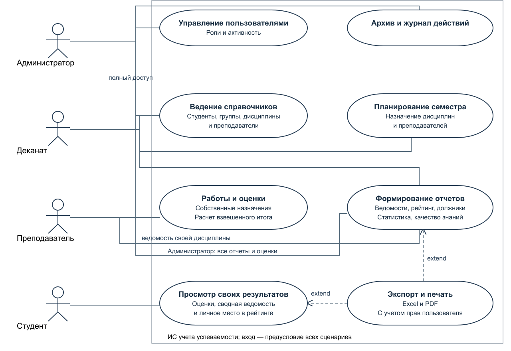

# 3 Use Case диаграмма

## 3.1 Акторы и цели

Администратор обеспечивает работоспособность учетных записей и имеет полный доступ к прикладным функциям. Сотрудник деканата поддерживает состав контингента и назначает дисциплины. Преподаватель ведет работы и оценки по своим назначениям. Студент получает свои результаты и место в группе. Обязательная предпосылка всех прикладных действий — действующая сессия.

## 3.2 Основные сценарии и исключения

### UC01 Вход в систему

Актор: Все роли. Предусловие: Пользователь зарегистрирован и активен.

Основной поток: Открыть страницу; ввести логин и пароль; нажать «Войти». Сервер проверяет пароль, создает сессию и показывает меню роли.

Расширения и исключения: Неверные данные → 401; десять неудачных попыток → 429; неактивная запись не входит.

Постусловие: Пользователь получает доступ только к разрешенным разделам.

### UC02 Ведение справочников

Актор: Администратор, деканат. Предусловие: Выполнен вход; связанные записи уже созданы.

Основной поток: Открыть справочник; нажать «Добавить»; заполнить поля; сохранить. Для изменения выбрать строку, отредактировать и подтвердить сохранение.

Расширения и исключения: Пустое ФИО или неверные даты → 422; дубликат или отсутствующая связь → 409; отмена оставляет данные без изменений.

Постусловие: Новая или измененная запись доступна в таблице и журнале.

### UC03 Назначение дисциплины

Актор: Администратор, деканат. Предусловие: Существуют группа, дисциплина и преподаватель.

Основной поток: В «Назначениях» выбрать группу, дисциплину, преподавателя, семестр и год; сохранить.

Расширения и исключения: Повтор комбинации группа + дисциплина + семестр + год отклоняется; замена группы при наличии работ запрещена.

Постусловие: Группа и преподаватель получают учебное назначение.

### UC04 Подготовка контрольных работ

Актор: Преподаватель, администратор. Предусловие: Есть доступное назначение.

Основной поток: Открыть «Контрольные работы»; указать назначение, название, вид, положительный вес и шкалу; сохранить.

Расширения и исключения: Чужое назначение → 403; нулевой вес или неверная шкала → 422; изменение шкалы работы с оценками запрещено.

Постусловие: Работа участвует в расчете итога назначения.

### UC05 Выставление оценки

Актор: Преподаватель, администратор. Предусловие: Студент входит в группу назначения; работа создана.

Основной поток: Открыть «Оценки»; выбрать студента и работу; ввести значение и комментарий; сохранить.

Расширения и исключения: Повторная оценка, другая группа или несовместимая шкала → 409; недостаточные права → 403.

Постусловие: Оценка сохранена, событие записано; итог пересчитан при следующем запросе.

### UC06 Формирование отчета

Актор: Администратор, деканат; ограниченно остальные роли. Предусловие: Есть учебные данные и права на выбранный вид.

Основной поток: Открыть «Отчеты»; выбрать тип и параметры; нажать «Сформировать»; прочитать таблицу.

Расширения и исключения: Для ведомости не выбрано назначение → 422; чужие данные → 403; пустая выборка → сообщение «Нет данных».

Постусловие: Показана выборка из единого представления результатов.

### UC07 Экспорт и печать

Актор: Роли, имеющие право на отчет. Предусловие: Выбран допустимый отчет и параметры.

Основной поток: После формирования нажать Excel или PDF; сохранить файл. Для печати нажать «Печать» и выбрать принтер.

Расширения и исключения: Ошибка прав не создает файл; для пустого отчета выгружается сообщение об отсутствии данных.

Постусловие: Получен файл того же отчета либо открыт диалог печати.

### UC08 Просмотр своих результатов

Актор: Студент. Предусловие: Учетная запись связана со студентом.

Основной поток: Войти; просмотреть «Оценки»; в «Отчетах» выбрать сводную ведомость или рейтинг; сформировать.

Расширения и исключения: Подстановка чужого student_id или group_id отклоняется; отсутствие балльных итогов дает пустое среднее и место.

Постусловие: Доступны собственные результаты без персональных сведений одногруппников.

### UC09 Управление пользователями

Актор: Администратор. Предусловие: Есть права администратора и профиль при необходимости.

Основной поток: Открыть «Пользователи»; задать логин, пароль, роль и соответствующий профиль; сохранить.

Расширения и исключения: Недопустимая привязка → 422; повтор логина → 409; удаление, отключение или понижение своей записи запрещено.

Постусловие: Учетная запись создана; при изменении ее старые сессии отозваны.

### UC10 Резервное копирование

Актор: Администратор стенда. Предусловие: Доступны Docker и рабочая база.

Основной поток: Запустить scripts/backup.sh; проверить файл dump; для проверки восстановить в отдельную базу.

Расширения и исключения: Пустой путь или отсутствие подтверждения блокирует restore.sh; ошибка восстановления оставляет web остановленным.

Постусловие: Получена полная копия; восстановление проверяется контрольным запросом.

Экспорт является необязательным расширением просмотра отчета: пользователь может ограничиться таблицей на экране. Аутентификация — общая предпосылка сценариев; отсутствие или истечение сессии возвращает пользователя к входу. Отмена подтверждения критического действия завершает сценарий без изменения данных.