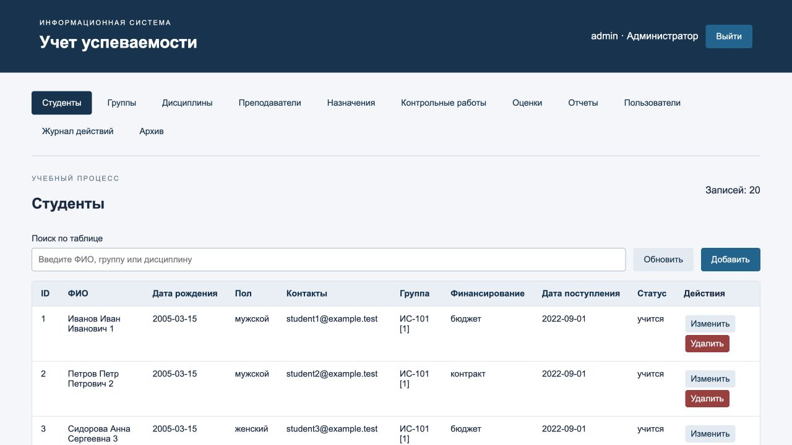
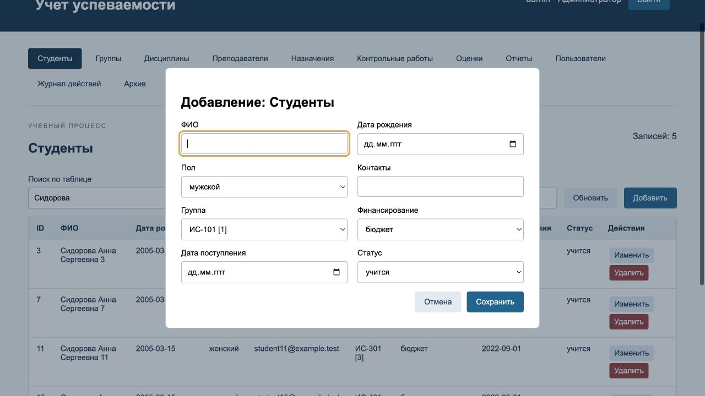
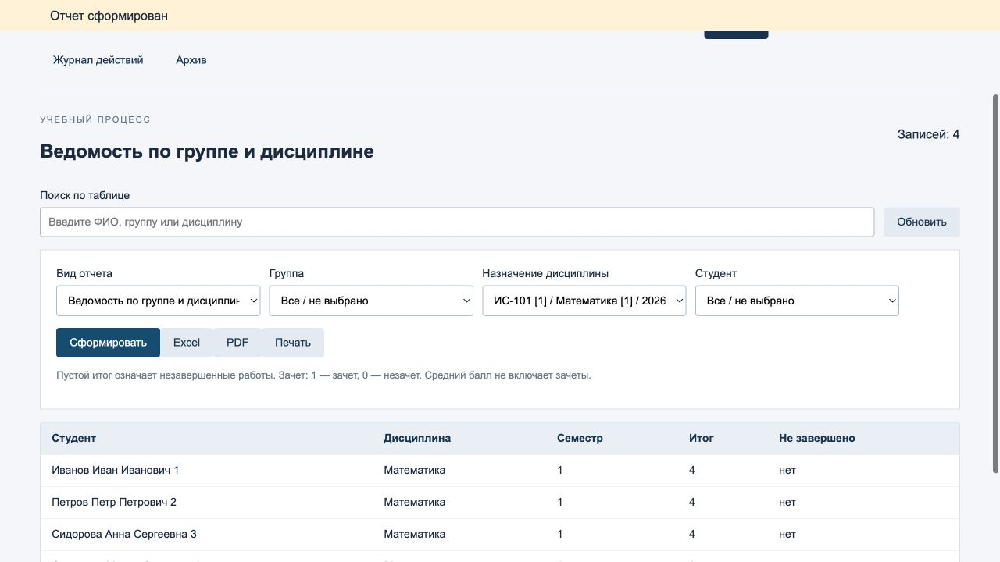
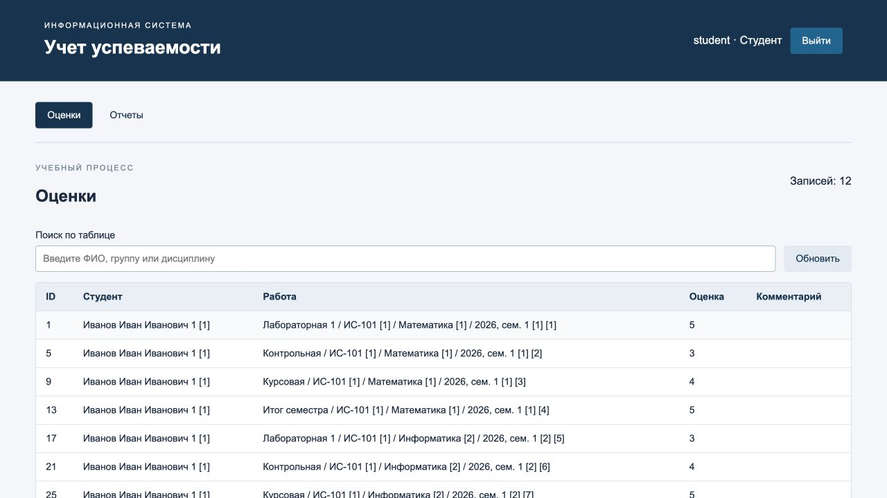
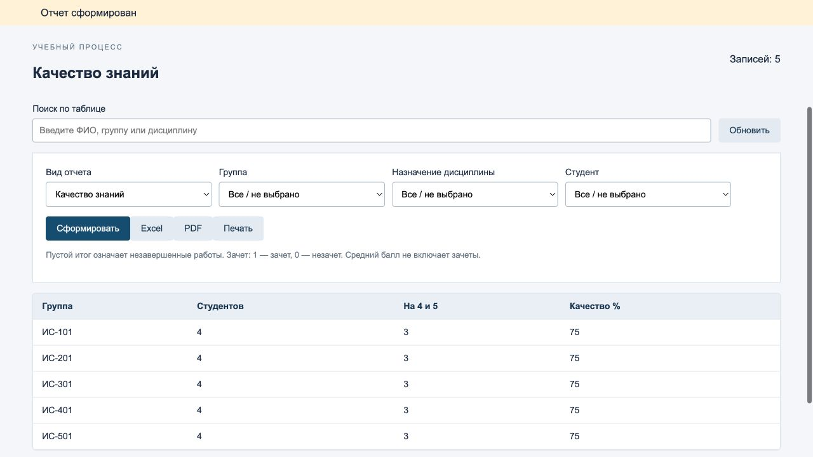

# 6 Руководство пользователя

## 6.1 Назначение и требования

Система предназначена для учета студентов, групп, дисциплин, преподавателей, контрольных работ и оценок. Пользователь работает в браузере; отдельная установка клиентского приложения не требуется. Для запуска сервера нужны Docker и Compose v2, свободный порт 8000 и доступ к Интернету при первой сборке. После запуска приложение открывается по адресу http://localhost:8000.

## 6.2 Установка и первый запуск

Шаг 1. Получите папку проекта или склонируйте репозиторий. Откройте терминал в корне, где расположен compose.yaml. Шаг 2. Скопируйте пример настроек в .env. Шаг 3. Запустите Docker Desktop и выполните сборку. Шаг 4. Проверьте состояние контейнеров и откройте приложение.

```
git clone https://github.com/YksusOneFourSeven/project.git
cd project
cp .env.example .env
docker compose up -d --build
docker compose ps
```

Папка sql подключена к /docker-entrypoint-initdb.d. Скрипты 01_schema.sql, 02_seed.sql и 03_checks.sql выполняются по порядку только при первом создании пустого тома pgdata. Повторный запуск контейнеров не стирает данные и не повторяет заполнение. При изменении DDL для уже существующего тома требуется осознанное обновление схемы; пересборка web сама по себе базу не меняет.

Для остановки используйте docker compose down: именованный том сохранится. Команда docker compose down -v удаляет том с учебной базой; применять ее можно только после сохранения нужных данных и при намерении начать заново. Для обычного запуска удалять том не нужно.

## 6.3 Вход и выход

Таблица 20 — Демонстрационные учетные записи

| Логин | Роль | Пароль |

| --- | --- | --- |

| admin | Администратор | DemoPass123! |

| dean | Деканат | DemoPass123! |

| teacher | Преподаватель № 1 | DemoPass123! |

| student | Студент № 1 | DemoPass123! |

Введите логин и пароль и нажмите «Войти». В шапке появятся имя учетной записи и роль. Если пароль неверен, проверьте регистр букв и раскладку. После серии неверных попыток подождите пятнадцать минут. Для завершения работы нажмите «Выйти». При истечении восьмичасовой сессии выполните вход повторно.

## 6.4 Общие приемы работы с таблицами

Выберите раздел в меню. Введите часть ФИО, названия или другого значения в поле «Поиск по таблице»: фильтр применяется ко всем отображаемым столбцам. Нажатие заголовка столбца сортирует данные; повторное нажатие меняет направление. «Обновить» заново загружает данные с сервера. В широких таблицах доступна горизонтальная прокрутка.

«Добавить» открывает форму новой записи. Кнопка «Изменить» открывает заполненную форму выбранной строки; перед сохранением требуется подтверждение. Кнопка «Удалить» также запрашивает подтверждение. Если запись используется другими объектами, сервер отклонит удаление. Кнопка «Отмена» закрывает форму без сохранения. Необязательные ссылки можно оставить в состоянии «Не выбрано».



## 6.5 Порядок работы администратора

1. Войдите как admin. 2. Проверьте справочники и создайте необходимые профили преподавателей и студентов. 3. В разделе «Пользователи» нажмите «Добавить», задайте уникальный логин и пароль не короче десяти символов. 4. Выберите роль. Для student укажите только студента, для teacher — только преподавателя, для admin и dean оставьте обе привязки пустыми. 5. Сохраните запись.

При редактировании пользователя пустое поле пароля означает «не менять пароль». Изменение учетной записи отзывает ее старые сессии, поэтому пользователю придется войти снова. Для отключения выберите «Активен: Нет». Текущий администратор не может удалить, отключить или понизить собственную роль. Чтобы изменить пароль demo-admin через интерфейс, введите новый пароль в его форме и после сохранения войдите повторно.

Раздел «Журнал действий» показывает последние 500 событий. Для прикладной выгрузки выберите «Архив» и скачайте JSON. Для полного резервного копирования пользуйтесь инструкцией 6.10. Настройки развертывания задаются в .env и compose.yaml; отдельный редактор инфраструктурных параметров в браузере не предусмотрен.

## 6.6 Порядок работы деканата

1. Войдите как dean. 2. В «Преподавателях» заполните ФИО, кафедру, должность, степень и контакты. 3. В «Группах» задайте название, специальность, курс, форму обучения, год набора и при необходимости куратора. 4. В «Студентах» внесите сведения и выберите группу. 5. В «Дисциплинах» задайте название, описание, часы и форму контроля. 6. В «Назначениях» свяжите группу, дисциплину и преподавателя с годом и семестром.

Порядок создания важен: связанные справочники должны существовать до назначения и оценки. Бюджет/контракт у студента — финансирование; очная/заочная/очно-заочная у группы — форма обучения. Эти признаки не следует смешивать. Для студента предусмотрены статусы «учится», «академический отпуск» и «отчислен». Изменение статуса не удаляет историю результатов.



Для получения ведомости откройте «Отчеты», выберите вид и назначение дисциплины. Для сводной ведомости выберите студента. Для рейтинга выберите группу. Для должников, статистики и качества можно оставить все группы либо ограничить выборку. Деканат не управляет учетными записями и не выставляет оценки.

## 6.7 Порядок работы преподавателя

1. Войдите как teacher или под своей созданной записью. 2. Просмотрите «Назначения» и список своих групп. 3. В «Контрольных работах» создайте работу, выберите назначение, вид и вес. Для дисциплины с зачетом используйте шкалу «зачет», для экзамена или курсовой — «балл». 4. В «Оценках» выберите студента нужной группы и работу; введите оценку и при необходимости комментарий. 5. Сохраните. 6. Сформируйте ведомость своего назначения.

В балльной шкале вводятся 2–5; в зачетной — 1 для зачета и 0 для незачета. Для изменения уже введенной оценки используйте «Изменить», поскольку повторное добавление той же пары студент/работа будет отклонено. Вес задается у работы один раз для всех студентов. Изменение веса влияет на итог при следующем формировании отчета.

Если итог пустой, проверьте наличие оценки по каждой работе назначения. Нельзя назначать студенту работу чужой группы. Если работа с оценками создана в неверном назначении, исправление требует сначала убрать ошибочные оценки и только затем изменить связь; обычный перенос истории между назначениями запрещен.



## 6.8 Порядок работы студента

1. Войдите под учетной записью, связанной с вашим профилем. 2. Откройте «Оценки»: список содержит только ваши работы и оценки. 3. Перейдите в «Отчеты». 4. Выберите «Сводная ведомость студента» для истории либо «Рейтинг студентов» для среднего балла и собственного места. 5. Нажмите «Сформировать». При необходимости скачайте Excel или PDF.

Студент не может добавлять, изменять или удалять записи. Его идентификатор определяется сервером по учетной записи. В рейтинге показывается только его строка; место вычисляется относительно группы. Пустой средний балл означает, что еще нет завершенных балльных дисциплин.



## 6.9 Экранные формы и экспорт

Таблица 21 — Перечень экранов

| Экран | Поля и действия |

| --- | --- |

| Вход | Логин, пароль, кнопка входа |

| Студенты | ФИО, рождение, пол, контакты, группа, финансирование, поступление, статус |

| Группы | Название, специальность, курс, форма, год набора, куратор |

| Дисциплины | Название, описание, часы трех видов, форма контроля |

| Преподаватели | ФИО, кафедра, должность, степень, контакты |

| Назначения | Группа, дисциплина, преподаватель, семестр, учебный год |

| Контрольные работы | Назначение, название, тип, вес, шкала |

| Оценки | Студент, работа, значение, комментарий |

| Отчеты | Вид, группа, назначение, студент; формирование и экспорт |

| Пользователи | Логин, пароль, роль, профиль, активность |

| Журнал | Пользователь, действие, объект, время; поиск и сортировка |

| Архив | Скачивание прикладного JSON; ссылка на полный backup-скрипт |

Кнопки Excel и PDF повторяют серверный запрос с текущими параметрами отчета. Они экспортируют всю серверную выборку, а не только строки, оставшиеся после локального поиска в таблице. Печать относится к отображаемой таблице. При смене типа или параметров перед печатью нажмите «Сформировать», чтобы на экране находился нужный отчет.

В Excel первая строка закреплена, включен автофильтр, текстовые значения не интерпретируются как формулы. В PDF используется кириллический шрифт и альбомная страница; заголовок таблицы повторяется на следующей странице. Пустой отчет содержит понятное сообщение вместо поврежденного файла.



## 6.10 Резервное копирование и восстановление

Полная копия создается из корня проекта следующей командой. Файл сохраняется в backups с датой и временем; папка исключена из Git, поскольку реальная копия может содержать персональные данные и хеши паролей. Копируйте архив на отдельный носитель согласно принятому регламенту.

```
sh scripts/backup.sh
```

Для восстановления выберите нужный dump и укажите флаг --confirm. Скрипт остановит web, восстановит данные в одной транзакции и запустит web после успеха. Восстановление заменяет существующее содержимое базы; сначала сохраните текущую копию. При ошибке приложение останется остановленным, чтобы не продолжать работу в неясном состоянии.

```
sh scripts/restore.sh backups/progress-ДАТА-ВРЕМЯ.dump --confirm
docker compose ps
docker compose logs --tail=50 web
```

Практический учебный регламент: полная копия перед изменением схемы и после завершения крупного ввода; регулярная проверка восстановления в отдельной базе. Интерфейсный JSON-архив не включает пользователей, сессии, журнал и схему; автоматически восстановить весь стенд из него нельзя. Для восстановления используйте именно dump.

## 6.11 Часто задаваемые вопросы

### Приложение не открывается

Проверьте Docker Desktop, docker compose ps и docker compose logs web. Если порт 8000 занят, измените только левую часть сопоставления порта и откройте новый адрес.

### После пересборки нет новых таблиц

DDL выполняется только при первом создании тома. Для сохранения истории подготовьте изменение схемы. Повторная сборка web не переинициализирует PostgreSQL.

### Почему запись не удаляется

На нее ссылаются другие записи. Например, у группы есть студенты или назначения. Не удаляйте историю ради косметического изменения; исправьте доступные поля.

### Почему оценка отклонена

Проверьте шкалу, группу студента и наличие уже введенной оценки за эту работу. Преподаватель должен быть назначен на соответствующую дисциплину.

### Почему средний балл не совпадает со средним всех работ

Сначала вычисляются взвешенные итоги дисциплин. Затем берется среднее завершенных балльных итогов. Зачеты и отсутствующие значения исключаются.

### Почему студент видит только одну строку рейтинга

Это правило приватности: место вычисляется по группе, но возвращаются только собственные сведения.

### Почему после изменения пользователя нужно войти снова

Изменение учетной записи отзывает все ее ранее созданные сессии.

### Можно ли использовать настоящие данные сразу

Сначала замените демонстрационные пароли, настройте HTTPS и резервное копирование и согласуйте правила работы с данными в организации.

### Как отправить проект на GitHub

Все файлы подготовлены локально. После настройки авторизации Git выполните git push -u origin main. Если на сервере есть собственная история, сначала выполните git fetch и согласуйте истории без force push.